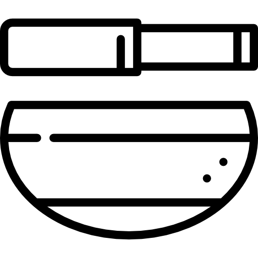
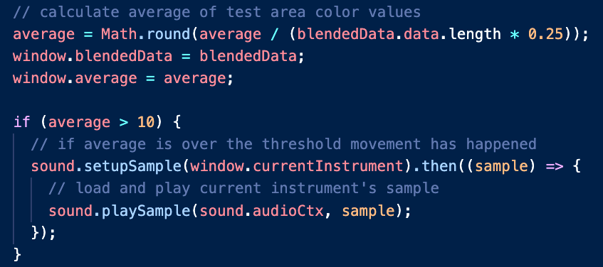
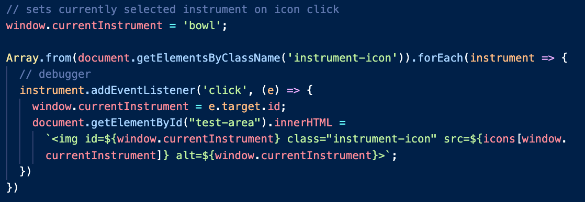
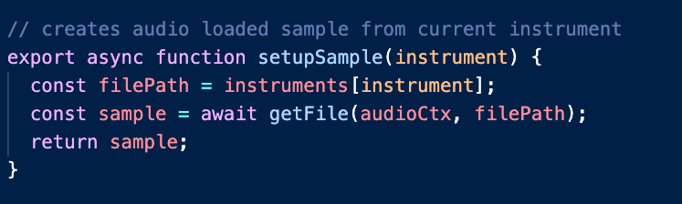

# Welcome to upepo! 

Upepo is a motion detection app that let's you use soundtherapy instruments with nothing but you webcam!  

## Step one: 
Choose an instrument in the side panel

## Step two: 
Wave your hand in the orange circle and hear the instrument play!

## Step three: 
Add some soothing wind sounds by pressing the play button in the top right corner.

# Technologies

## Libraries:

- `Web Audio API`
- `MediaDevices`

## Node Packages:

- `Node Sass`

# Challenges 

## Diff Algorithm:

In order to get upepo's webcam motion detection working I had to learn a lot about diff algorithms.  A lot.

This is the code that actually finds the difference in pixel values of frames within the orange circle and triggers the sound.

## Sound buffering

Through the use of `Web Audio` Web API and a dynamic event listener callback I was able to load the appropriate sound associated with the instrument selected from the side panel.  When a user clicks on an instrument, a window variable `window.currentInstrument` is updated, which in turn updates an `` elements's src attribute.

Once that src attribute is updated, `window.currentInstrument` is passed to the setupSample function which creates the new Audio Context and returns the buffered sample ready to be manipulated in other functions (i.e. playSample, stopSample, etc)

